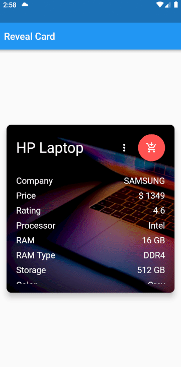

# Reveal Card

Reveal Card widget helps you to create a card with a title, description, and a background image. Also you can add a button to the card. The card also contains a backside with a title, description and a background image. The card can be revealed up and the backside can be displayed.

## Sample



## Getting started

Sample Code

```
RevealCard(
          height: 350,
          width: 350,
          title: const Text(
            'HP Laptop',
            style: TextStyle(color: Colors.white, fontSize: 30),
          ),
          revealIcon: const Icon(
            Icons.more_vert,
            color: Colors.white,
          ),
          actionButton: FloatingActionButton(
            backgroundColor: Colors.redAccent,
            onPressed: () {},
            child: const Icon(Icons.add_shopping_cart),
          ),
          backgroundImage: const NetworkImage(
              'https://images.unsplash.com/photo-1525547719571-a2d4ac8945e2?ixlib=rb-1.2.1&ixid=MnwxMjA3fDB8MHxwaG90by1wYWdlfHx8fGVufDB8fHx8&auto=format&fit=crop&w=764&q=80'),
          content: [
            Row(
              mainAxisAlignment: MainAxisAlignment.spaceBetween,
              children: const [
                Text('Company', style: TextStyle(color: Colors.white, fontSize: 18)),
                Expanded(
                  child: Text(
                    'SAMSUNG',
                    style: TextStyle(color: Colors.white, fontSize: 18),
                    textAlign: TextAlign.right,
                  ),
                ),
              ],
            ),
            const SizedBox(
              height: 30,
            ),
            Row(
              mainAxisAlignment: MainAxisAlignment.spaceBetween,
              children: const [
                Text('Price', style: TextStyle(color: Colors.white, fontSize: 18)),
                Expanded(
                  child: Text(
                    '\$ 1349',
                    style: TextStyle(color: Colors.white, fontSize: 18),
                    textAlign: TextAlign.right,
                  ),
                ),
              ],
            ),
            const SizedBox(
              height: 30,
            ),
            Row(
              mainAxisAlignment: MainAxisAlignment.spaceBetween,
              children: const [
                Text('Rating', style: TextStyle(color: Colors.white, fontSize: 18)),
                Expanded(
                  child: Text(
                    '4.6',
                    style: TextStyle(color: Colors.white, fontSize: 18),
                    textAlign: TextAlign.right,
                  ),
                ),
              ],
            ),
          ],
          revealBackgroundImage: const NetworkImage(
              'https://images.unsplash.com/photo-1603302576837-37561b2e2302?ixlib=rb-1.2.1&ixid=MnwxMjA3fDB8MHxwaG90by1wYWdlfHx8fGVufDB8fHx8&auto=format&fit=crop&w=1468&q=80'),
          revealCloseIcon: const Icon(Icons.close, color: Colors.white),
          revealTitle: const Text(
            'Specifications',
            style: TextStyle(fontSize: 26, color: Colors.white),
          ),
          revealContent: [
            Row(
              mainAxisAlignment: MainAxisAlignment.spaceBetween,
              children: const [
                Text(
                  'OS',
                  style: TextStyle(fontSize: 18, color: Colors.white),
                ),
                Text(
                  'Windows 11',
                  style: TextStyle(fontSize: 18, color: Colors.white),
                ),
              ],
            ),
            const SizedBox(
              height: 30,
            ),
            Row(
              mainAxisAlignment: MainAxisAlignment.spaceBetween,
              children: const [
                Text(
                  'Hard Drive',
                  style: TextStyle(fontSize: 18, color: Colors.white),
                ),
                Text(
                  'SSD',
                  style: TextStyle(fontSize: 18, color: Colors.white),
                ),
              ],
            ),
          ],
        ),
```

## Arguments


| Argument              | Type                 | Required / Optional                        |
| :---------------------- | ---------------------- | -------------------------------------------- |
| title                 | Text                 | Required                                   |
| revealIcon            | Icon                 | Optional                                   |
| content               | List Widget          | Required                                   |
| height                | double               | Optional (Default - 300)                   |
| width                 | double               | Optional (Default - 300)                   |
| actionButton          | FloatingActionButton | Optional                                   |
| backgroundImage       | ImageProvider        | Optional (Default - backgroundColor)       |
| opacity               | double (0 - 1)       | Optional (Default - 0.5)                   |
| backgroundColor       | Color                | Optional (Default - White)                 |
| revealTitle           | Text                 | Optional                                   |
| revealCloseIcon       | Icon                 | Optional                                   |
| revealContent         | List Widget          | Optional                                   |
| revealBackgroundColor | Color                | Optional (Default - White)                 |
| revealBackgroundImage | ImageProvider        | Optional (Default - revealBackgroundColor) |
| revealOpacity         | double (0 - 1)       | Optional (Default - 0.5)                   |
| revealDuration        | Duration             | Optional (Default - 200 milliseconds)      |

## Additional information

* Front side- Title, Content, Reveal Button, Action Button, Background Image.
* Back side- Title, Content, Close Button, Background Image.
* Action Button - Define function to be performed on user click.

On reveal button click, the back side will be revealed with a bottom up animation.

## Note

Enlarge the height and width of the card based on the content. Otherwise the contents will get overflowed.
